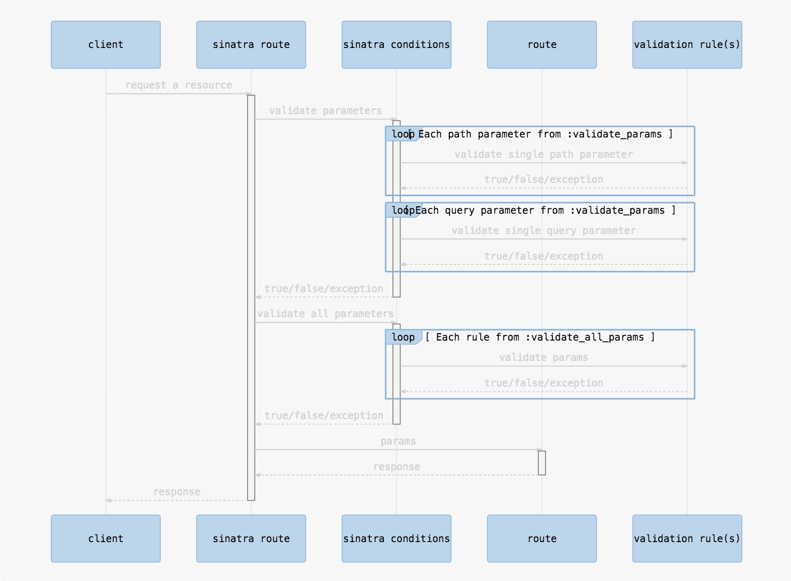
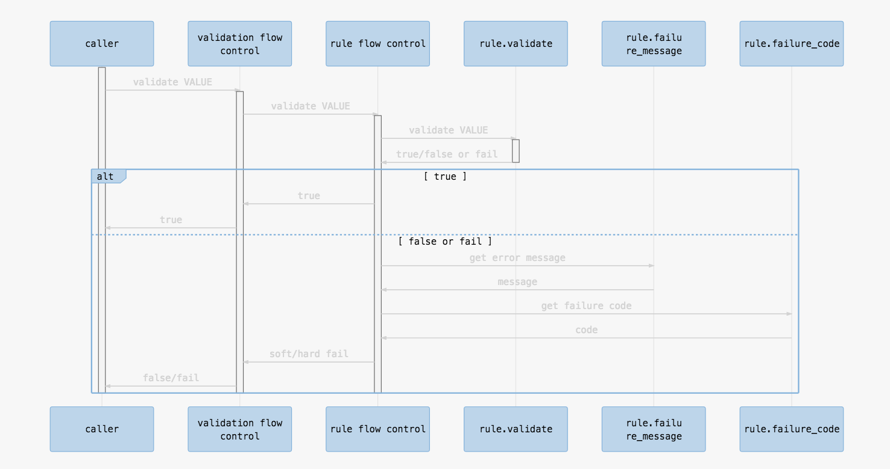

# ValidateMyRoutes Architecture

## API request validation flow

## Rule validation

For **all parameters validation** `VALUE` is a Sinatra `params`
For **single parameter validation** instead of `VALUE` there will be 2 parameters:
  `PARAM_VALUE, PARAM_NAME`

