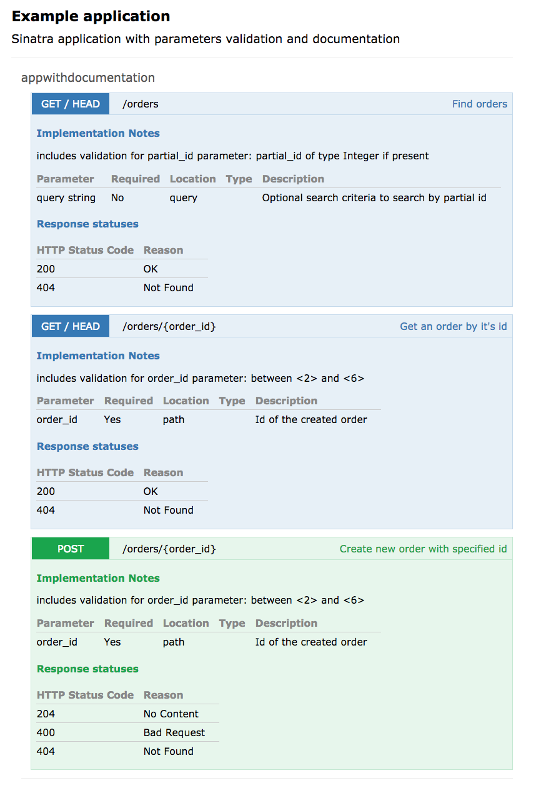

# Example with using `doc_my_routes` and `validate_my_routes`

In this example you can see how you can use `validate_my_routes` together with
[doc_my_routes](https://github.com/Workday/doc_my_routes) in a simple sinatra application
to get nice documentation and parameters validation.

In this example you can find `defined_parameters` mixin that can be
used to simplify usage of two gems by defining parameters.
After you defined a parameter it will automatically get documentation
and validation from this definition.

To test it simply install dependencies:

```bash
bundle install
```

And start the webserver:

```bash
bundle exec ruby app.rb
```

This will generate documentation at `./doc/api/index.html` and will start webserver serving
application at `http://localhost:8080/` so you can test the validation.



There are some examples of http requests in `tests.http` file.
